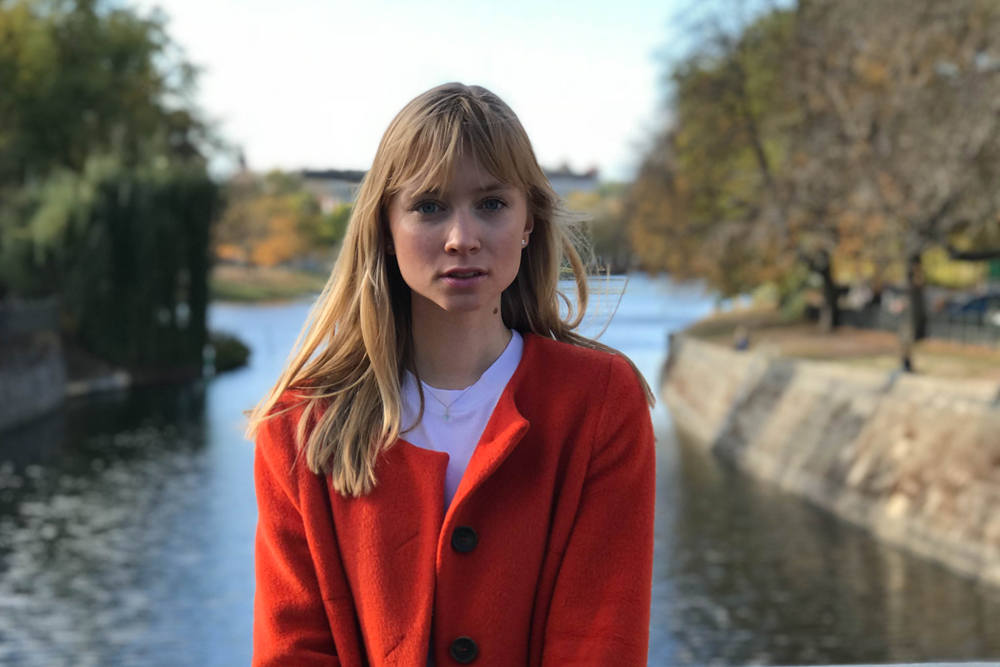

As I started my website, the goal was to write mainly about programming, show my progress from "zero to hero", and as a showcase for job opportunities. But as my life is ever-changing, bending to the constant surprises in life, I now feel like there is so much more that should be manifested as articles to share.

Some of you might know, that I made a big career change switching from medicine to tech, and some of you might know that I now live in the US (*as opposed to Estonia or traveling around the world*). I also applied to a prominent coding school, that I got accepted to, but decided not to attend after-all.

The last year has been crazy. And I think the hardest one yet. As from the outside it might seem I took the easy way out, I did actually quite the opposite. I am, however, chasing my dreams.

### Overcoming the fear of letting everyone down.

**The only person you should every worry letting down is You.**

In the beginning of last year, I decided to finish up with my medical studies. **The realization of following a path that was not aligned with *my* dreams and expectations of life hit me hard**. It was one of the toughest things I've done, but a decision I have not regretted even once.

As people close to me know, I've gone through a few adventures in my life. From modeling for almost a decade, to taking time off after graduating high school to travel full time, to solo backpacking in Costa Rica and Thailand, going to University to study medicine, and taking a sabbatical to follow my heart (and my love).

Sometimes I feel like everything I've done so far, every low point and every high, has taught and prepared me for this phase in my life now. Deciding to be an entrepreneur is deciding to take the much harder route. There is no security. The highs are higher, the lows are lower. **But you do it for the journey.**

### Learning through pain

I left University last February to start something with my other (*and better?*) half. He has been an entrepreneur since he was 18, started several successful companies, done some impressive work as a developer, as well as written a script for a movie (who *is* he??). He has been a true inspiration since I met him, and he also happens to be my soulmate.

Starting our first company didn't all go as planned. I realized there is a lot more I have to work on personally to be able to achieve what I intended to. While hiding my head in medical books for years, I missed out on getting some real-life skills like business, communication, doing things I have no experience with and overcoming my fear of failure. 

**I was so afraid to make a mistake that I made the biggest one yet - not starting.**

One of the most important lessons I learned was to stop being afraid and push through walls no matter what. **You rather hit the wall and fail than not even try at all.**

After a few months of working on a SaaS (Software as a Service) product, we understood we hadn't done enough work on first validating our idea, or market research. The idea was there, and we loved it, but the target market already had their gap filled. Other things happened too (*like getting engaged and starting an insane fiancé visa process for the US*), and we decided to move on to other things.

### .. and then there was programming

After gaining my first experience being an entrepreneur, I got an itch. I really wanted to learn how to code up something of my own and be able to contribute more to the projects we worked on. Working on *tech* startups is really quite tough when you don't know how to program.

Picking up coding was pretty easy for me. I can say thanks to the logical thinking I've inherited from my parents, and the love for sciences throughout my adolescence.

Learning to program still feels like something out of this world for me. I never thought I'd be a developer. Never in a million years! But here I am, building my first iOS and Android apps, *and they look amazing, by the way*.

And it *feels* so good to be able to create something that can literally reach anyone in the world.

### A laptop and WiFi is all you need.

Learning programming is still such a mystery to most people out there. It's considered something really nerdy and difficult. But it really isn't. I find it such an useful skill as our life is more and more filled and affected by technology. It is a great way to apply logical thinking and gives a wonderful sense of achievement when creating something of your own. 

All kids nowadays grow up with iPhones and tablets in their hands. Why not teach them some basic programming skills, so they have something better to do than games and social media that eat their brains?

It's not widely understood, but programming isn't that dull and mechanical as it might sound. It takes a lot of creativity and design skills to make a clever user interface (UI) and create great user experience (UX).

Many have proven that it isn't necessary to get an expensive degree to be able to get a job in big tech giants like Facebook, Google or Twitter. There are plenty of resources (*both, free and paid*) out there to learn. So, it's only up to the work anyone is ready to invest.

I hope the stigma around programming slowly disappears. I hope tech becomes more approachable, as it is something that anyone can do with just a laptop and WiFi.

### The coding bootcamp phase

Learning to code took me to a desire to apply for one of the best programming bootcamps out there. For a while, I thought I would feel more *real* if I went to a coding school and worked in one of the tech giants for a few years. So, I decided to apply to Fullstack Academy in NY. 

Their admissions process had 3 steps - the application, the online coding assessment of 6 algorithms, and a Skype interview with one of their teaching fellows.

Even though I had already taken several online courses for programming previously, I took weeks to prepare for the admissions. My goal was not to simply try, but to get accepted. 

I prepared by working on my connections in the industry, writing articles, improving my social profiles, working on projects to improve my GitHub profile, spending over hundred hours solving algorithms and taking a few *hours* to fill in the application so it would reflect my skills and potential appropriately.

I applied, and got accepted with flying colors.

After taking time to recover from this experience, *which took place while moving to another country and getting married*, I realized I had once again let myself believe my capabilities should be confirmed by someone from the outside. So, I decided to stick to my original plan - **live life on my own terms and follow whatever crazy dreams I have**.

### The look back

Looking back, it's been the crazies and hardest year, with a lot of sweat and too many tears. But I am happy to have learned what I have learned - 

* I now know, *I mean really know*, there is no easy way to success.

* I know that no matter what happens, I have to keep running at that wall with full speed with no fear of failure because there is nothing worse that failing without trying. 

* I now know, since I experience this every other day, is that there will always be moments when I feel like *I don't know anything* - it will pass as I keep adding layers to my knowledge with hard work.

* I now know that I am capable for much more than I ever believed before.

* I now know I'd rather fail at doing something I love, rather than in something I don't.

### What's next?

The crazy adventures - the longer path, where lows are lower, and highs are higher. But we do it for the journey.

