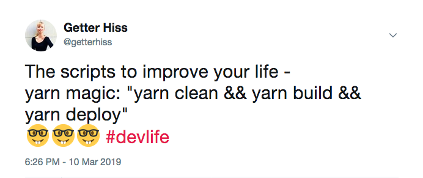
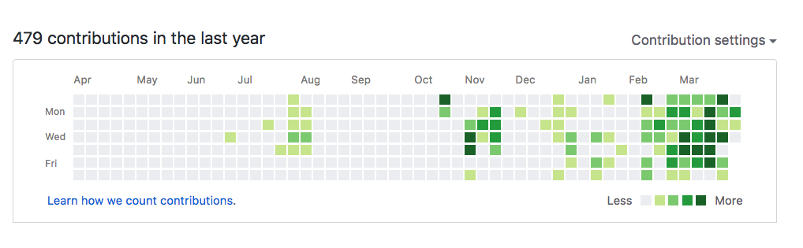

In my [previous article](https://getterhiss.com/medicine-to-tech/) I wrote about my journey to tech and learning to code. I made a promise to write more about how I got accepted to a *top-of-the-class* coding bootcamp in NY. 
The whole process was a great experience for me and I hope sharing the steps I took will help someone else out there to find their way as well.

## Picking the right program

There are dozens of bootcamps out there but it really comes down to what is your situation when picking the right one. You can always apply to all of them and decide according to the results, but for me it was just that *one*. 

I realized, after doing some research, that if there was a program I would attend, it would be [Grace Hopper](https://www.gracehopper.com/) by Fullstack Academy. It is part of the Fullstack Academy's immersive course for becoming a fullstack Javascript developer, that offers a special deferred tuition plan for women. I found it great because I had already picked up Javascript and the deferred tuition plan offered the security of getting more support while trying to find a good position *post*-graduation. I was impressed by all the feedback they get from their Alumni, *plus* the extra bonus of meeting more women in the industry (*as women are still a rare sight in tech*).

## Research the admissions process
Seems very obvious, but if you are not familiar with the admissions process, it's quite tough to make a schedule and prepare. The process may vary depending on the school, but it is usually something similar to a) **sending an application** that contains your resume, b) an online **coding assessment**, and c) **an interview**.

Based on the application, you can see if there is anything that still needs work. For me, those were things like getting all my code up on Github to show that I've *really* been coding on some projects, and my social profiles - like LinkedIn, which I never really used as actively before.

## Learn the Basics
It's helpful to know which programming language you want to work with in the future. I chose Javascript since it is the most widely spread programming language in the world. It covers about 70% of the Web today and is used in backend (*the part you don't see, like databases, servers, api's*), as well as frontend (*evertyhing you see - the user interface*) applications. It is also quite easy to learn and since it has a huge community, it's easy to find help on Github or Stackoverflow. Knowing Javascript is also a huge advantage when trying to find a job as a developer, since that's what most companies work with.

### Learning Javascript
The first programming course I ever took was [**Introduction to Javascript**](https://www.codecademy.com/learn/introduction-to-javascript) on Codecademy. If you're on Codecademy for the first time, you get a 7-day trial to access all the Pro materials. I recommend using it as a motivation to finish the whole course in a week, which is just about enough time to do it. I am all up for paying for quality materials, but having the trial period gave me enough motivation to really focus and push through it as fast as possible.

Random fact: *I joined Codecademy on Jun 27, 2018*, so that's when I first started programming :)

### Learning CSS & HTML
CSS (Cascading Style Sheets) and HTML (Hypertext Markup Language) are what you need for styling. These are the languages that anyone who is a frontend developer knows and works with. They can be tough to master, but once you do, it's like magic!

I took [**Introduction to HTML**](https://www.codecademy.com/learn/learn-html) and  [**Learn CSS**](https://www.codecademy.com/learn/learn-css) right after finishing the Javascript course.
These are both quite quick and shouldn't take more than a few days. If you're done with the free trial and can't pay for the Pro membership, don't worry - just do everything else and you'll still get a great intro to these two languages.

### React JS
If you really want to become a developer and you've chosen Javascript, there is no way around React. Once you're already on Codecademy, I recommend both, the [**Learn ReactJS: Part I**](https://www.codecademy.com/learn/react-101) and [**Part II**](https://www.codecademy.com/learn/react-102). This gives you enough to be able to start working on your own projects later without having to read every single piece through documentation.

### The Command Line
The command line is the text interface for your computer. You can say, it is the language to talk to the computer itself. You can access files, create programs, run servers, and *so much more* using the command line.

To be a true developer, it is *crucial* to learn how to use it. There are plenty of resources out there, but I know best the one on [Codecademy]((https://www.codecademy.com/learn/learn-the-command-line) ), since it's the one I took. Later on, while working on projects and reading documentation for different libraries, you will learn more tips and tricks on how to make your life easier.

### NodeJS & databases

Node is for all the back-end things in JavaScript. I took a course by Mosh Hamedani on [Udemy.com](https://www.udemy.com/nodejs-master-class/learn/lecture/9990182#overview). I found him a great teacher with a good voice to listen to. The course also covers [ExpressJS](https://expressjs.com/), working with a NoSQL database, and gives you an insight to test driven development. I sincerely recommend it!

Make sure to cover the **differences between SQL** (such as [Postgres](https://www.postgresql.org/), [CockroachDB](https://www.cockroachlabs.com/) and [MySQL](https://www.mysql.com/)) **and NoSQL** (like [MongoDB](https://www.mongodb.com/)) **databases**. It might be difficult to understand all of this first, but as you keep learning, things start making more sense along the way!

## Stop worrying if you know enough and start building

There is no better way to learn to just start doing to practice what you already have learned.

**We tend to fall into the trap of believing we don't know enough** -- and that happens in any profession. 

Luckily, programming is not like being a doctor, you can literally start applying your knowledge right away. I would recommend trying to build your first simple web app (like a To-Do app, checklist, Login/Signup form, etc..) or an API project *ASAP* after learning your first skills!

### My first API project - HipsterWeather

As my first try, I decided to make a weather API that tells you the current weather situation in "Hipster language". I used Dark Sky API to get weather from different locations of the world by longitude and lattitude, then added some "funk" to the weather report depending on the results. This project never got completed, but I learned a ton, made really good notes of my process, and you can [check it out on here](https://github.com/getterhiss/hipster-weather).

##Connect with others in the industry
If you're new to the industry and don't have many friends who are techies, make sure to get your foot in the door by hanging out where they do. 

* Check out pages like [HackerNews](http://hckrnews.com/) and [ProductHunt](https://www.producthunt.com/) to see what's new in the industry.
* Listen to podcasts about tech - my favorite is [IndieHackers](https://www.indiehackers.com/podcast).
* Find the biggest names in the industry on Twitter to see what they are up to - it's great to see that there are ton of people always working on something.
* If you are part of minority groups, make sure to get in touch since it's a wonderful way to extend your network and get help when needed.

## Make your Github profile show your progress
Learning to use Git is another crucial step in a developers career. It is a true lifesaver when working on any project, especially as the projects grow and more people are involved.

[Github](https://github.com/) is just one of the options when picking an online version control service, but it is definitely the most widely used platform out there right now. When applying for coding schools or jobs, your Github profile is one of the things the recruiters will ask for. Make sure to tune it up to represent you well enough!

Make repositories for things you've been working on (*adding detailed notes is a huge advantage*) as well as take the opportunity to contribute to open source projects.

## Solve coding algorithms

One of the steps in the interview process for jobs and bootcamps, both, is solving algorithms. This means, you will be given an problem to solve programmically and you have to solve it either on a whiteboard (*on jobs*) or online tests  (*bootcamps*). For some, it may come naturally, but most need a little bit of practice to get used to the way questions are built up.

Before you jump to any courses, I recommend checking out [CodeWars](https://www.codewars.com/) and [HackerRank](https://www.hackerrank.com/) to see what typical algorithms look like.

Then, I highly recommend the course (*once again*) by Stephen Grider on [Udemy](https://www.udemy.com/coding-interview-bootcamp-algorithms-and-data-structure/). In his course, Stephen teaches how to solve the most common algorithms on coding interviews (*like FizzBuzz, MaxChars, Palindromes, String Reversal, Mergesort, and others*) in multiple ways. For me, this was a huge help, since there can be so many different approaches.

After understanding how the process works, prepare to spend *hours* solving different problems to be fully prepared for your interview.

HackerRank and CodeWars are both basically the same thing, but I preferred CodeWars since it conveniently shows other's answers based on ratings right after you've completed yours. This helps to learn more clever ways to approach problems in programming.

## Write a killer application
**Show personality. Show your ambition.** Even if you don't have previous experience with coding, or a college degree, show the things you *have* done and experiences you have got. Show how you'd fit and and enrich the group you are trying to join.

**Show some personal interest** - if you love the industry, show it! Have a personal portfolio (*or a Blog, as some may call it*) to show and talk about things you do and opinions you have. When you learn something new, write an article about it or make a video tutorial. It shows you are keen to help others and helps you stand out.

## Don't forget to ask for help
Being a programmer is an endless journey of problem-solving. No matter how far along you are in your career, there will always be times when you get really stuck. Nothing to be ashamed of since there is so much to learn about programming. Luckily, there are plenty of others to ask help from. For programmers, [MDN documentation](https://developer.mozilla.org/en-US/) and [StackOverflow](https://stackoverflow.com/) should be the first places to go!

## Final tips

* Apply before the last admissions date since there might be a lot of people applying. 
* Let someone else check your application before you send it in. Ask advice on what they think you're missing.
* Keep practicing algorithms every day. Even if it's just one a day.
* Connect with the chosen bootcamp's alumni to ask about their experience and help if needed.
* Show your enthusiasm and energy on the interview when you get to it. Ask questions about them too to make sure that's the bootcamp you really want to join.
* Don't freak out. Take it as a learning experience - you will always have another try - it is not *Harvard*, after all.

### *What's up with all the talk about Codecademy?*

I mentioned and linked to this resource several times, and it's because how I first learned to program. Everyone learns differently, some like video courses, some like just plain reading. For me, Codecademy was the perfect place to start.

### Things I liked about Codecademy

* The **learning environment** in Codecademy has set up perfectly for complete beginners - the whole material, including code editor is in your browser, which means you don't need to install anything or switch between windows to do the exercises.
* **The way they explain things** is understandable for anyone. All terms are explained well and they give plenty of examples, as well as ask you to start writing lines of code right away so you get used to it fast.
* **There are no videos**, but rather an interactive lesson, which means you can *truly* go in your own pace.
* **The summaries** in the end of each block give you an easy way to revise everything you learn. They are basically notes for the future. My recommendation is to **take screenshots of everything** to use as notes! (*Command-Shift-4 to take one from a specific area on a Mac*)
* **The forum** is a excellent way to find help if you get stuck. I also just recommend searching for a solution online - there have been many before you struggling with the same things.
* They have **projects to learn new concepts** and **the quizzes** in the end of each block make sure you're on the right track.
